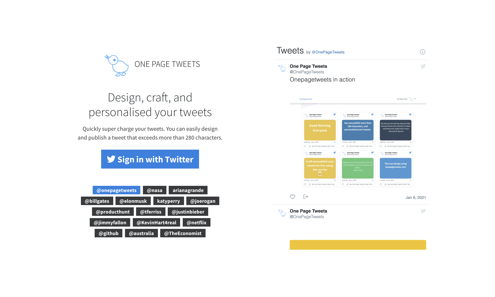

## One Page Tweets

Design, and publish more words with Onepagetweets.com



## Codebase

The codebase is using [NodeJS](https://nodejs.org/en/), template engine [Handlebars](https://handlebarsjs.com/), [Turbolinks](https://github.com/turbolinks/turbolinks) for SPA like experience, and [MongoDB Atlas](https://www.mongodb.com/cloud/atlas) for the cloud database. Quite a simple setup.

I also used this guide [Node.JS Best Practices](https://github.com/goldbergyoni/nodebestpractices) for the structure of the project.

## Local Development

Install

`npm install`

Debug mode

`npm run debug`

## Setting up MongoDB Atlas

- Go to [https://www.mongodb.com/cloud/atlas](https://www.mongodb.com/cloud/atlas)

- Click the green **Get started free** button

- Fill in your information then hit **Get started free**

- You will be redirected to Create New Cluster page.

- Select a **Cloud Provider and Region** (such as AWS and a free tier region)

- Select cluster Tier to **Free Shared Clusters**

- Give Cluster a name (default: Cluster0)

- Click on green **:zap:Create Cluster button**

- Now, to access your database you need to create a DB user. To create a new MongoDB user, from the **Clusters view**, select the **Security tab**

- Under the **MongoDB Users** tab, click on **+Add New User**

- Fill in a username and password and give it either **Atlas Admin** User Privilege

- Next, you will need to create an IP address whitelist and obtain the connection URI. In the Clusters view, under the cluster details (i.e. SANDBOX - Cluster0), click on the **CONNECT** button.

- Under section **(1) Check the IP Whitelist**, add the server `ip address`. Click **SAVE** to save the `ip address` whitelist.

- Under section **(2) Choose a connection method**, click on **Connect Your Application**

- In the new screen, select **Node.js** as Driver and version **2.2.12 or later**. _*WARNING*_: Do not pick 3.0 or later since connect-mongo can't handle mongodb+srv:// connection strings.

- Finally, copy the URI connection string and replace the URI in MONGODB_URI of `.env.example` with this URI string. Make sure to replace the <PASSWORD> with the db User password that you created under the Security tab.

- Note that after some of the steps in the Atlas UI, you may see a banner stating `We are deploying your changes`. You will need to wait for the deployment to finish before using the DB in your application.

## Auth Provider - Twitter

- Sign in at <a href="https://developer.twitter.com/en/apps" target="_blank">https://developer.twitter.com/en/apps</a>

- Click **Create an app**

- Enter your application name, website and description

- For **Callback URL**: http://127.0.0.1:8080/auth/twitter/callback - // non www

- Go to **Settings** tab

- Under _Application Type_ select **Read and Write** access

- Check the box **Allow this application to be used to Sign in with Twitter**

- Click **Update this Twitter's applications settings**

- Copy and paste _Consumer Key_ and _Consumer Secret_ keys into `.env` file

## Setting up the Production Server in Digital Ocean

- Create Droplet

- Choose Marketplace and search for `Docker` image.

- Follow the following steps as a guide: [Create Droplet](https://www.digitalocean.com/docs/droplets/how-to/create/)

- Login to the server, and install python.

```
ssh root@<ip address>
```

```
apt-get update
apt install python
```

- Initialise docker swarm in the server

```
docker swarm init --advertise-addr [ip-address]
```

## Setting up Custom Domain via Namecheap

- Login to namecheap, go to your domain and navigate to `Advance DNS`

- Create an `A Record` and put the following configuration

```
Type = A Record
Host = @
Value = <ip address>
TTL = Automatic

Type = A Record
Host = www
Value = <ip address>
TTL = Automatic
```

- Wait for a few seconds.. Your custom domain should now be pointed to the newly created server. example: `onepagetweets.com`

## Setting up SSL Certificate

- Create a directory in the server (droplet) at `/opt/onepagetweets` and copy the whole source code. Use Cyberduck to make this task easier.

- Navigate to the `opt/onepagetweets` and look for the `dc:cert` script in `package.json`.

- Update the `email` in `dc:cert`

- Copy the command and execute it. (Don't bother to install NPM or Node.JS as we are going to delete this folder as soon as the certificate was installed.)

- Before running this command, please make sure the your `.env` file values doesn't happen any quotation marks.

```
//this is wrong
SENTRY_DSN="value"

//this is correct
SENTRY_DSN=value
```

```
docker-compose -f dc-cert.yml build
&& docker-compose -f dc-cert.yml up -d
&& docker-compose -f dc-cert.yml ps
```

- Verify if the certificate has been created in `/etc/letsencrypt/live`

- If everything is okay and ready to go live, and you found your generated certs in `/etc/letsencrypt/live`, then open `dc-cert.yml` file.

- change the `--staging` to `--force-renewal` and run the following command:

```
docker-compose -f dc-cert.yml up --force-recreate --no-deps certbot
```

- Clean up images, containers, etc.

```
docker rm -f $(docker ps -a -q) && docker volume prune -f

docker rmi $(docker images -a -q) -f
```

- Delete the folder `/opt/onepagetweets`

- Exit the server

## Generating Diffie-Hellman key to be used in SSL

Enabling SSL will also involve specifying our Diffie-Hellman group, which we will use for [Perfect Forward Secrecy](https://en.wikipedia.org/wiki/Forward_secrecy):

- In your terminal, generate the key via:

```
sudo openssl dhparam -out dhparam-2048.pem 2048
```

- Login to the droplet server and create a directory in `/etc/ssl/dhparam`

- transfer the `dhparam-2048.pem` into that directory.

- If you go to `nginx-conf/nginx.conf`, you will see this configuration.

```

//nginx-conf/nginx.conf

ssl_dhparam /etc/ssl/dhparam/dhparam-2048.pem;
```

## Let Google Crawl the webapp

- Go to this site https://search.google.com/search-console

- and verify the ownership of the site. The easiest verification is
  by adding:

```
<meta name="google-site-verification" content="XXXXX />

```

## Docker Hub

Dockerhub provides one free private repository per account.
To take advantage of this, we will create the private repository using the following format:

```
<projectName>/images

tags: <name of the project>

example:

onepagetweets/images:tweets-web
onepagetweets/images:tweets-proxy

```

## Contributing

If you've got an improvement, just send in a pull request. If you've got feature ideas, simply [open a new issues](https://github.com/chardmd/onepagetweets/issues/new)!

## Author

Richard Dimalanta [https://chardmd.com](http://chardmd.com)
